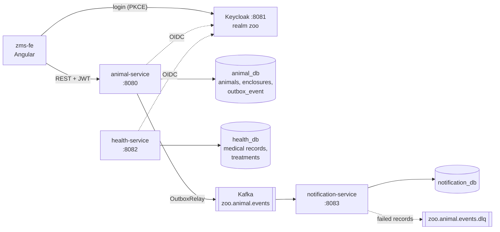

# Zoo Management System

> **TODO (maintainer): two-line pitch.**

**What this project demonstrates**

> **TODO (maintainer): three things this project demonstrates.**
> 1. …
> 2. …
> 3. …

| Folder | What it is | Details |
|---|---|---|
| [`zms-be/`](zms-be/) | Java 21 / Quarkus microservices, Postgres, Kafka, Keycloak | [Backend README](zms-be/README.md) |
| [`zms-fe/`](zms-fe/) | Angular 22 frontend (SSR) | [Frontend README](zms-fe/README.md) |
| [`docs/`](docs/) | Events, decisions, current state | [events](docs/events.md) · [decisions](docs/decisions.md) · [state](docs/STATE.md) |

## Screenshots

> **TODO (maintainer): screenshots not added yet.** Expected files in `docs/images/`:
>
> | File | Content |
> |---|---|
> | `docs/images/animal-list-desktop.png` | Animal list grouped by enclosure, desktop |
> | `docs/images/animal-list-mobile.png` | Animal list on a phone |
> | `docs/images/animal-detail.png` | One animal's record |
> | `docs/images/status-change.png` | Status change sheet (vet) |
> | `docs/images/transfer.png` | Transfer sheet (keeper) |
> | `docs/images/register.png` | Register sheet (admin) |
> | `docs/images/dark-mode.png` | Any screen in dark mode |

## Architecture



- **animal-service**: registers animals, changes their status, transfers them between enclosures, and lists enclosures. Publishes animal events through a transactional outbox. [README](zms-be/animal-service/README.md)
- **health-service**: medical records and treatments. Refers to animals by id only, with no call to animal-service. It has a REST API but no UI yet. [README](zms-be/health-service/README.md)
- **notification-service**: consumes animal events and stores one notification per event. No REST API. [README](zms-be/notification-service/README.md)
- **feeding-service**: not started.

Each service has its own Postgres database and follows the same hexagonal layout (`infrastructure → application → domain`).

### Event flow

1. A write use case in `animal-service` saves the animal and inserts an `outbox_event` row in the same transaction.
2. `OutboxRelay` runs every 2 seconds and sends unpublished rows to `zoo.animal.events` in order, keyed by animal id.
3. `notification-service` consumes the event, skips it if its `eventId` was already stored, and saves a notification. A record that fails for any reason goes to `zoo.animal.events.dlq`.

Delivery is at-least-once. Events, payloads, ordering, duplicates and unhandled cases are in [docs/events.md](docs/events.md).

## Design decisions

Summary of [docs/decisions.md](docs/decisions.md), where each entry has its context and consequences:

- **Hexagonal layout** in every backend service. `DomainPurityTest` fails the build if `domain/` imports a framework.
- **Repository pattern**, not Active Record. The application layer never sees JPA entities.
- **Transactional outbox** for animal events. Consumers must be idempotent.
- **No foreign key** from animals to enclosures. Unknown enclosures are rejected in the application layer.
- **Role matrix** per endpoint with `@RolesAllowed`: keepers transfer, vets change clinical status, admins register.
- **Demo mode as the frontend default**, with in-memory data and a role switcher. Live mode is a build configuration.
- **Keycloak login with PKCE** in the frontend.

## Known limits

From [docs/STATE.md](docs/STATE.md), which has the full list:

- `health-service` does not check that an animal exists or is alive before writing a medical record or treatment.
- Published outbox rows are never cleaned up. An outbox row that always fails blocks the rows behind it.
- `notification-service` sends valid events to the DLQ on a database failure instead of retrying. Nothing reads the DLQ.
- Notifications have no recipients, no delivery channel and no API.
- There is no server-side search. The frontend loads the whole roster and filters in the browser.
- The frontend has no screens for medical records or notifications.
- `feeding-service` is not started, and its scope is not defined.
- In the prod profile there is no way to create enclosures.

## Run it

### Demo mode: frontend only, no backend

Needs Node and pnpm.

```bash
cd zms-fe
pnpm install
pnpm start
```

Open http://localhost:4200. Data lives in memory and a role switcher in the header replaces the login. This mode runs locally only; no demo build is published.

### Live mode: frontend + backend + Keycloak

Needs Docker, Java 21, Node and pnpm.

1. **Create the local `.env` files.** No secret is committed. Create a `.env` file in each folder below with these variables. Any value works locally, but values on the same row of the [matching table](zms-be/README.md#local-configuration) must be equal.

   | Folder | Required | Optional (default) |
   |---|---|---|
   | `zms-be/infrastructure` | `POSTGRES_PASSWORD`, `POSTGRES_HEALTH_PASSWORD`, `POSTGRES_NOTIFICATION_PASSWORD`, `KEYCLOAK_ADMIN_PASSWORD`, `OIDC_CLIENT_SECRET`, `HEALTH_OIDC_CLIENT_SECRET`, `ZOO_TEST_USER_PASSWORD` | `POSTGRES_USER`, `POSTGRES_HEALTH_USER`, `POSTGRES_NOTIFICATION_USER` (`zoo`); `KEYCLOAK_ADMIN_USERNAME` (`admin`) |
   | `zms-be/animal-service` | `DB_PASSWORD`, `OIDC_CLIENT_SECRET` | `DB_USERNAME` (`zoo`) |
   | `zms-be/health-service` | `DB_PASSWORD`, `OIDC_CLIENT_SECRET` | `DB_USERNAME` (`zoo`) |
   | `zms-be/notification-service` | `DB_PASSWORD` (template: `env.example` in the same folder) | `DB_USERNAME` (`zoo`) |

   Source: `zms-be/infrastructure/docker-compose.yml` and each service's `application.properties`. You only need the `.env` of the services you run.

2. **Start the infrastructure** (three Postgres databases, Keycloak, Kafka):
   ```bash
   cd zms-be/infrastructure
   docker compose up -d
   ```

3. **Start animal-service** on :8080. From `zms-be/animal-service`:
   ```bash
   ./mvnw quarkus:dev
   ```
   ```powershell
   .\mvnw.cmd quarkus:dev
   ```
   `health-service` (:8082) and `notification-service` (:8083) start the same way from their own folders. The frontend needs only `animal-service`.

4. **Start the frontend in live mode** on :4200:
   ```bash
   cd zms-fe
   pnpm start:live
   ```

5. Open http://localhost:4200. The app redirects to Keycloak; sign in with one of the users below.

## Users and roles

The Keycloak realm `zoo` is imported from [`realm-export.json`](zms-be/infrastructure/keycloak/realm-export.json) with three users. They all share one password: the value of `ZOO_TEST_USER_PASSWORD` in `zms-be/infrastructure/.env`.

| User | Role | Can do |
|---|---|---|
| `admin.rossi` | `zoo-admin` | Everything: register animals, change status, transfer, write medical records and treatments |
| `vet.bianchi` | `zoo-vet` | Read animals, change their status, write medical records and treatments |
| `keeper.conti` | `zoo-keeper` | Read animals and medical records, transfer animals between enclosures |

All three can list enclosures. Medical records are available through the `health-service` API only. The full endpoint matrix is in the [backend README](zms-be/README.md#security).

Every write records who made it (`createdBy` / `updatedBy`, taken from the token).

The Keycloak admin console is at http://localhost:8081 (`KEYCLOAK_ADMIN_USERNAME` / `KEYCLOAK_ADMIN_PASSWORD` from `zms-be/infrastructure/.env`).

## Troubleshooting

All commands below work in bash and PowerShell. Run them from `zms-be/infrastructure`.

**`docker compose` fails with "required variable ... is missing a value".**
`zms-be/infrastructure/.env` is missing one of the required variables in the table above. Compose checks all services at once, so a single missing variable blocks everything. The error text says "copy env.example to .env first", but that folder has no `env.example`; use the table.

**Login says "Invalid username or password" for users that should exist.**
Keycloak imports the realm only when it does not exist yet, and this setup keeps no Keycloak volume, so recreating the container re-imports it:
```bash
docker compose up -d --force-recreate keycloak
```

**A service fails at startup with `password authentication failed for user "zoo"`.**
Postgres applies `POSTGRES_PASSWORD` only when its volume is first created, so changing `.env` later has no effect. Open a shell on the database (example for the animal database; use `postgres-health` or `postgres-notification` for the others):
```bash
docker compose exec postgres-animal psql -U zoo -d postgres
```
Then, at the `postgres=#` prompt, set the password to the value in your `.env` (replace `zoo` if you changed the user):
```sql
ALTER USER zoo PASSWORD 'value-from-your-env';
\q
```
Or delete the volumes, which deletes all local data:
```bash
docker compose down -v
```
